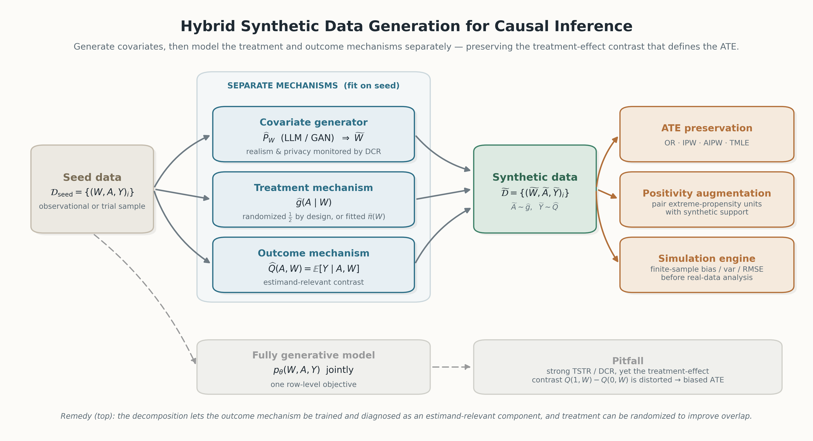

# Generative Synthetic Data for Causal Inference: Pitfalls, Remedies, and Opportunities

<p align="center">
  
</p>

Synthetic tabular data are usually judged by distributional similarity, privacy distance, or
train-on-synthetic-test-on-real (TSTR) predictive performance. **None of these guarantee validity for
causal inference.** This repository shows that fully generative tabular synthesizers (GAN- and
LLM-based) can preserve predictive utility while distorting the average treatment effect (ATE), and it
provides a **hybrid** remedy: generate covariates, then model the treatment and outcome mechanisms
separately so the estimand-relevant contrast `Q(1,W) − Q(0,W)` is preserved.

## The pitfall, and the remedy

For the ATE, `Ψ(P) = E_W[Q(1,W) − Q(0,W)]`, causal fidelity depends on the covariate law **and** the
treatment-effect contrast. Ordinary prediction loss decomposes into a prognostic term plus an
**overlap-weighted** contrast term with weight `π(W){1−π(W)}` — so under imbalance or limited overlap a
generator can reproduce dominant factual outcomes while underlearning the contrast. Row-level
generative objectives therefore give weak control of the very quantity the ATE depends on.

The **hybrid** design (figure above, Algorithm 1 in the paper):

1. Train a generative model on the seed data to synthesize **covariates** `W̃`, monitoring realism and
   privacy with distance-to-closest-record (DCR).
2. Fit a **treatment mechanism** `ĝ(A|W)` — randomized `1/2` by design for a synthetic experiment, or a
   fitted propensity — and an **outcome mechanism** `Q̂(A,W)` on the seed data.
3. For each `W̃`, draw `Ã ∼ ĝ(·|W̃)` and `Ỹ ∼ Q̂(Ã, W̃)`.

## Repository map

Each main-text result unit maps to one directory:

| Paper result | Directory | What it shows |
|---|---|---|
| **Figure 1** | `privacy/` | TSTR AUC & DCR vs. ATE MSE (IPW/AIPW/OR/TMLE) for full-generative vs. hybrid, LLM & GAN |
| **Table 1** | `positivity/` | Synthetic augmentation for practical positivity problems (MSE across scenarios) |
| **Table 2** | `simulator/` | Hybrid simulation engine: real-vs-synthetic finite-sample fidelity |
| **Table 3** | `actg175/` | ACTG175 real-data application: TSTR RMSE, DCR, and ATE estimates |

Supporting code and appendix material:

- `algs/` — the estimators: outcome regression, IPW, AIPW, and TMLE (binary and continuous outcomes).
- `data_generate.py`, `truth.py`, `truth.json` — the base simulation DGP and Monte-Carlo ground-truth ATE.
- `llm_full.py`, `gan_full.py`, `syn_clean.py`, `syn_hybrid.py` — GReaT (GPT-2) / CTGAN generators and the
  hybrid covariate+mechanism construction for the simulation study.
- `more_simulation/`, `outcome_aug/` — appendix stress tests (varying overlap, dimension, seed size,
  outcome complexity, and outcome-model misspecification).

## Installation

```bash
conda create -n llm_aug python=3.9
conda activate llm_aug
pip install -r requirements.txt
```

`requirements.txt` pins the exact versions used for the experiments (Python 3.9.23). The main-text
results run on CPU; a CUDA 12.1 GPU is only needed to (re)train the GReaT/CTGAN generators.

## Reproducing the main-text results

The synthetic-data artifacts are committed, and the downstream estimator/aggregation scripts are
deterministic (fixed seeds), so the figures and tables reproduce directly.

```bash
# Figure 1 — privacy / causal-fidelity diagnostics  (~2 min, CPU)
python privacy/run_tstr.py
python privacy/run_dcr.py
python privacy/run_privacy_estimators.py
python privacy/agg_mse_ate.py
python privacy/plot_privacy_tradeoffs.py          # -> privacy/plot/*.png

# Table 1 — positivity augmentation  (deterministic aggregation, <5 s)
python positivity/collect.py                      # -> positivity/results/positivity_mse_by_n_table.json

# Table 2 — simulation-engine fidelity  (~3-6 min, CPU)
python simulator/run_simulator_self_ref.py
python simulator/extract_fidelity.py              # -> simulator/results/real_fidelity_table_compact.json

# Table 3 — ACTG175 application  (~3-5 min, CPU)
python actg175/run_tstr_mse.py
python actg175/run_dcr.py
python actg175/run_estimator.py                   # -> actg175/results/actg_estimators.json
```

Optional, stochastic, GPU-recommended — regenerate the synthetic data from scratch (GReaT GPT-2
fine-tuning + CTGAN), then rerun the steps above:

```bash
python llm_full.py && python gan_full.py          # covariates + full-generative rows
python syn_clean.py && python syn_hybrid.py        # hybrid covariate + mechanism construction
```

## Data

All data required for the main-text results are included. The simulation data are produced by the
committed generator scripts and bundled as CSVs; **ACTG175** is a publicly available HIV clinical-trial
dataset and is also bundled directly (`actg175/actg175.csv`). Large model checkpoints
(GReaT/GPT-2, CTGAN weights) are intentionally excluded and are not needed to reproduce the results
from the committed data.

## Citation

```bibtex
@inproceedings{xu2026generative,
  title     = {Generative Synthetic Data for Causal Inference: Pitfalls, Remedies, and Opportunities},
  author    = {Xu, Yichen},
  booktitle = {STAI-X},
  year      = {2026}
}
```
